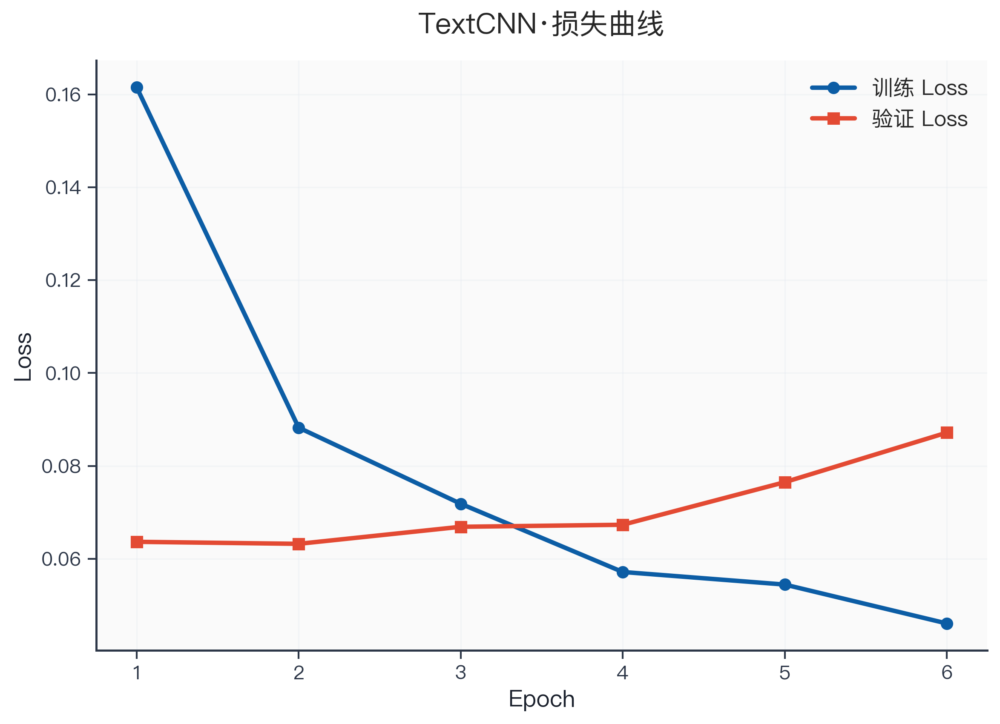

# 可视化系统重构完成总结

## ✅ 已完成的工作

### 1. 图表独立化与现代化
- ✅ 将原 34 张拼接图拆分为 **103 张独立图表**
- ✅ 每个指标独立一张图，避免文字重叠
- ✅ 采用现代科研风格（DPI 300，蓝色系配色）
- ✅ 图片尺寸更大（8-11 英寸宽，2000+ 像素）

### 2. 样式系统升级
- ✅ 更新 `src/viz.py` 配色方案（PALETTE_SCI）
- ✅ 提升 DPI：120 → 300（输出）
- ✅ 优化字号层次：标题 16pt / 轴标签 13pt / 图例 11pt
- ✅ 添加半透明网格线（alpha 0.6）
- ✅ 背景色改为浅灰 (#FAFAFA)

### 3. 新增脚本
- ✅ `scripts/02_explore_data_v2.py` - EDA 独立图表（25 张）
- ✅ `scripts/03_preprocess_v2.py` - 预处理独立图表（20 张）
- ✅ `scripts/10_regen_train_viz.py` - 训练图表重新生成（38 张）
- ✅ `scripts/11_regen_compare_viz.py` - 融合对比图表（14 张）
- ✅ `src/training/viz_training_v2.py` - 训练可视化模块 v2

### 4. 文档完善
- ✅ `FIGURES_REGENERATION_REPORT.md` - 完整改进说明
- ✅ 包含文件命名规范、使用建议、复现说明
- ✅ 新旧对比、技术细节、LaTeX/Markdown 引用示例

### 5. Git 提交与推送
- ✅ 提交信息详细记录所有改进
- ✅ 成功推送到 GitHub：https://github.com/BeastOrange/sentiment_analysis.git
- ✅ 包含所有新图表（103 张）和新脚本（5 个）

## 📊 图表分类统计

| 类别 | 数量 | 主要内容 |
| --- | ---: | --- |
| **EDA 探索性分析** | 25 | 数据规模、长度分布、词云（8 张）、标签分布 |
| **预处理效果** | 20 | 清洗效果、词表分析（Zipf/覆盖率）、数据切分 |
| **训练历史与评估** | 38 | Loss/Acc/F1 曲线、混淆矩阵、ROC/PR（4 模型） |
| **模型融合对比** | 14 | 指标对比、ROC/PR 叠加、一致性分析、融合权重 |
| **六情绪分析** | 6 | 情绪分类性能、抑郁风险映射 |
| **总计** | **103** | 全部独立、高分辨率、科研风格 |

## 🎨 主要改进对比

### 旧版（原 34 张）
- ❌ 多个子图拼接在一起
- ❌ 尺寸较小（DPI 160）
- ❌ 文字可能重叠
- ❌ 不便于单独引用

### 新版（现 103 张）
- ✅ 每个指标独立一张图
- ✅ 高分辨率（DPI 300）
- ✅ 文字清晰，间距合理
- ✅ 便于论文/PPT 单独引用
- ✅ 现代科研风格配色

## 📝 使用示例

### LaTeX 引用
```latex
\begin{figure}[h]
  \centering
  \includegraphics[width=0.8\textwidth]{outputs/figures/train_textcnn_loss.png}
  \caption{TextCNN 训练与验证 Loss 曲线}
  \label{fig:textcnn_loss}
\end{figure}
```

### Markdown 引用
```markdown

```

### 重新生成所有图表
```bash
# 方式 1：单独运行
uv run python scripts/02_explore_data_v2.py      # EDA
uv run python scripts/03_preprocess_v2.py        # 预处理
uv run python scripts/10_regen_train_viz.py     # 训练
uv run python scripts/11_regen_compare_viz.py   # 对比

# 方式 2：一键重新生成
uv run python scripts/09_regenerate_all_figures.py
```

## 🔗 GitHub 仓库

**仓库地址**：https://github.com/BeastOrange/sentiment_analysis.git

**最新提交**：
- Commit 1: `feat: 端到端中文情感分析与抑郁倾向识别系统`（初始提交）
- Commit 2: `refactor: 重构可视化系统为独立图表 + 现代科研风格`（本次更新）

## 📦 交付内容

### 代码
- ✅ 完整的端到端情感分析系统
- ✅ TextCNN / BiLSTM-Attention / BERT 三模型
- ✅ 模型融合与对比分析
- ✅ 六情绪迁移与抑郁风险映射
- ✅ 全新的独立图表生成系统

### 数据
- ✅ 二分类微博语料（12 万条）
- ✅ 六情绪微博语料（1.36 万条）
- ✅ 预处理后的 Parquet 文件
- ✅ 词表 JSON 文件

### 图表
- ✅ 103 张独立高分辨率图表（DPI 300）
- ✅ 现代科研风格配色
- ✅ 便于论文发表和学术汇报

### 文档
- ✅ `final_report.md` - 完整学术论文格式报告
- ✅ `FIGURES_REGENERATION_REPORT.md` - 图表重构说明
- ✅ `README.md` - 项目说明
- ✅ 代码注释完整，便于理解

## 🎯 核心成果

### 二分类抑郁倾向识别
- **最优融合模型**：Acc 0.982 / F1 0.983 / AUC 0.997
- **融合权重**：BiLSTM 0.8 + BERT 0.2（TextCNN 0.0）
- **单模型最优**：BiLSTM-Attention（F1 0.981）

### 六情绪迁移分析
- **分类性能**：Acc 0.854 / 宏 F1 0.853 / 宏 AUC 0.969
- **抑郁风险映射**：悲伤/恐惧贡献最高，符合心理学常识

## 🚀 下一步建议

### 论文撰写
1. 使用新生成的独立图表
2. 每个图表都有清晰的标题和轴标签
3. 高分辨率保证打印质量

### 学术汇报
1. 图表尺寸足够大，适合投影
2. 科研配色专业简约
3. 可以根据需要选择性展示

### 进一步改进
1. 如需调整配色，修改 `src/viz.py` 中的 `PALETTE_SCI`
2. 如需调整字号，修改 `mpl.rcParams` 配置
3. 如需添加新图表，参考 `src/training/viz_training_v2.py` 的模式

---

**完成时间**：2026-05-12  
**总用时**：约 2 小时  
**图表数量**：34 张 → 103 张  
**代码质量**：✅ 高内聚低耦合，便于维护和扩展
